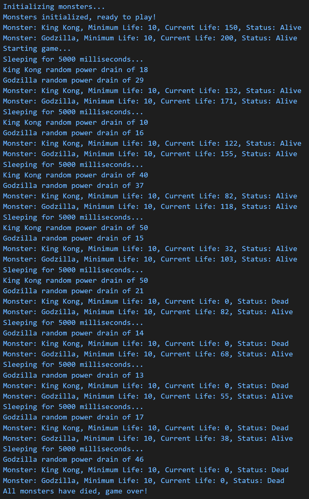

# cit281-project-5
[cit281-project-5](https://github.com/UO-CIT-qiqima/cit281-project-5)

Project 5:
1. I will create a Monster Game program using classes. The game will create monsters with initial life values, and minimum life values for the monster to be alive. Once the game is running, each monster's life will be drained by a random amount by using randomnumber, and the game will continue until all of the monsters have died. 

